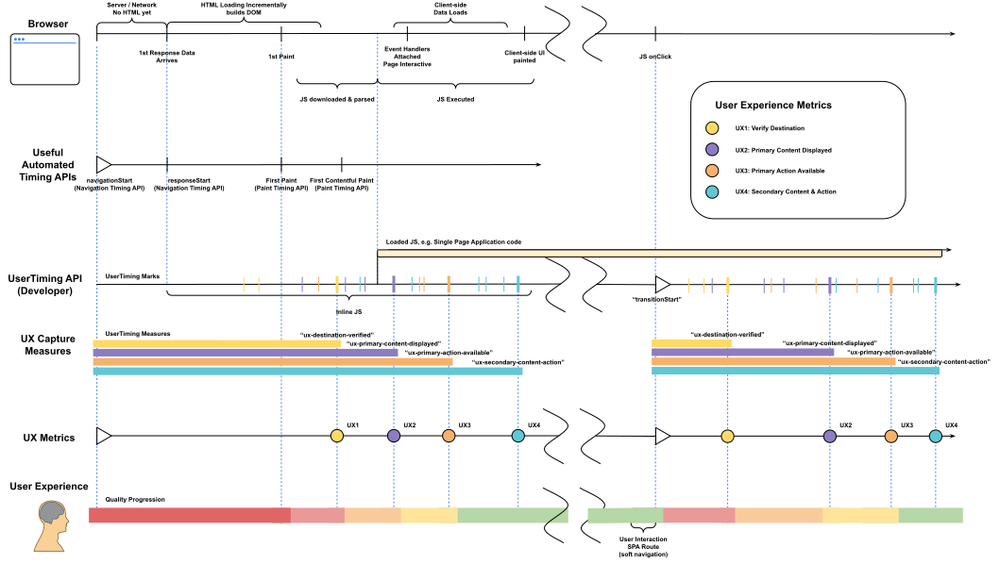

# UX Capture

Browser instrumentation approach and libraries that makes it easier to capture UX performance metrics.

- [UX Capture](#ux-capture)
  - [Packages](#packages)
    - [Publish workflow](#publish-workflow)
  - [Additional documentation](#additional-documentation)
  - [Project Goals](#project-goals)
  - [Instrumentation Approach](#instrumentation-approach)
    - [Individual Element Instrumentation](#individual-element-instrumentation)
      - [Image elements](#image-elements)
      - [Text without custom font](#text-without-custom-font)
      - [Text with custom font](#text-with-custom-font)
      - [Event handler attachment](#event-handler-attachment)
    - [Aggregating component metrics](#aggregating-component-metrics)
    - [Aggregating experience/perception phase metrics](#aggregating-experienceperception-phase-metrics)
  - [Testing results](#testing-results)
  - [UX Capture Lifecycle](#ux-capture-lifecycle)
  - [Glossary](#glossary)

## Packages

-   [@meetup/ux-capture](./packages/ux-capture) - Core library
-   [@meetup/react-ux-capture](./packages/react-ux-capture) - React component wrappers around library API
-   [@meetup/react-ux-capture-example](./packages/react-ux-capture-example) - Demo of React bindings in a simple SPA
-   [@meetup/gatsby-ux-capture-example](./packages/gatsby-ux-capture-example) - Demo of React bindings in [GatsbyJS](https://www.gatsbyjs.org/) app
-   [@meetup/gatsby-plugin-ux-capture](./packages/gatsby-plugin-ux-capture) - [GatsbyJS](https://www.gatsbyjs.org/) plugin for UX Capture
-   [@meetup/nextjs-ux-capture-example](./packages/nextjs-ux-capture-example) - Demo of React bindings in [NextJS](https://nextjs.org/) app

### Publish workflow

The packages are published with independent versions, which must be updated
manually _before_ a PR is merged. Lerna will walk you through the process of
tagging new versions when you run

```
$ yarn make-version
```

The Travis deploy step will then publish _only updated packages_ when the PR
merges. If you forget to bump a version, the deploy will fail and you will have
to run `yarn make-version` to push the latest tags

## Additional documentation

-  [Progressive Enhancement Phases and Corresponding Zones](docs/progressive_enhancement_phases.md)
-  [UX Capture JavaScript Library](ux-capture/packages/ux-capture/README.md)
   -  [UX Capture Core Library API Spec and seqence diagram](docs/ux-capture-js-api-spec.md)
-  [React bindings for UX Capture](packages/react-ux-capture/README.md)


---

## Project Goals

There are multiple goals for this project, many dictated by the lack of real
rendering instrumentation of paint events in the browser. These include:

-   Capture display and interactivity events for various UI elements (e.g. images,
    text, video, fonts, buttons, etc.)
-   Group together multiple display events for elements of a web page that
    represent the same design/product components.
-   Group together multiple components to reflect various phases of page load
-   Collect captured events and [_UX speed metrics_](#UX_speed_metrics) for all users using RUM (Real User Measurement) tools.
-   Calibrate in-browser instrumentation by recording page load video using
    synthetic tools and deriving same [_UX speed metrics_](#UX_speed_metrics)
-   Create uniform instrumentation for both [_page views_](#page_view) and
    [_interactive views_](#interactive_view), to be usable with any back-end and front-end framework
-   Future compatibility with [Element Timing API](https://wicg.github.io/element-timing/)
    that aims at adding instrumentation directly into browser and other similar innovations

## Instrumentation Approach

To understand speed of user's experience as it relates to specific product rather than using generic technical metrics metrics captured using the browser or automated tools.

Documentation below describes generic approach using Browser's native [UserTiming API](https://developer.mozilla.org/en-US/docs/Web/API/User_Timing_API), but this project also maintains a [UX Capture JavaScript Library](./packages/ux-capture), which replaces `performance.mark()` method with `UXCapture.mark()` method and aggregates multiple elements into multiple elements in the zone into a single measurement recorded as [UserTiming API's measures](https://developer.mozilla.org/en-US/docs/Web/API/PerformanceMeasure) to be used as [_UX speed metrics_](#UX_speed_metrics).

### Individual Element Instrumentation

Each element that needs to be instrumented might require one or more snippets
of code injected into a page to approximate browser events, they are then
aggregated and lastest of the events is considered to represent the moment when
element is ready for the user.

Number of snippets and exact code to be added to the page depends on the type
of element being measured and must be determined experimentally or discovered
in industry white papers or blogs as there is currently no direct method of
instrumenting the display timings in modern browsers.

Below is the list of instrumentation methods with examples:

#### Image elements

Image tracking requires two measurements, one within the `onload` callback of
the image itself and another within inline `<script>` tag directly after the
image.

```jsx

<script>performance.mark('ux-image-inline-logo')</script>
```

Element aggregation algorythm: latest of the two (`inline` and `onload`)
measurements.

References:

-   Steve Souders: [Hero Image Custom Metrics](https://www.stevesouders.com/blog/2015/05/12/hero-image-custom-metrics/),
    published on May 12, 2015

#### Text without custom font

Text that does not use a custom font can be instrumented by supplying one inline
`<script>` tag directly after the text:

```jsx
<h1>Headline</h1>
<script>performance.mark("ux-text-headline");</script>
```

Element aggregation algorythm: no aggregation, just one event.

References:

-   Steve Souders: [User Timing and Custom Metrics](https://speedcurve.com/blog/user-timing-and-custom-metrics/)
    (example 5), published on November 12, 2015

#### Text with custom font

Many pages use custom fonts to display text and often experience Flash of
Invisible Text or [FOIT](https://www.zachleat.com/web/fout-vs-foit/). It is
important to take into account time to load custom fonts. You can do it using
font loaders provided by [using event tracking in Web Font Loader](https://github.com/typekit/webfontloader#events)
used by Typekit and Google.

You can inline the library in HTML and then use the following code to fire a mark
when font loaded.

```jsx
<script>
WebFont.load({
    custom: {
        families: ["Montserrat:n4"]
    },
    active: function() {
        performance.mark("ux-font-montserrat-normal");
    }
});
</script>
```

**NOTE:** See [Font Variation Description](https://github.com/typekit/fvd) format
used by Web Font Loader for specifying particular font variation to track.

Similarly to tracking text without custom font, inject a mark inline after text
that uses custom font in question.

```jsx
<h2>Title with font</h2>
<script>performance.mark("ux-text-title-using-montserrat-normal");</script>
```

Element aggregation algorythm: latest of the two (`font` and `text`) measurements.

#### Event handler attachment

Some user activity requires custom JavaScript handler code to be attached to an
event on the page, e.g. `click` of the button (e.g. it's only "available" when
visible AND clickable). Instrumenting handler attachment is straightforward, just
include the call right after handler attachment in JavaScript code.

```jsx
button.addEventListener('click', myActionHandler);
performance.mark('ux-handler-myaction');
```

Element aggregation algorythm: no aggregation, just one event.

### Aggregating component metrics

Most design components on web page consist of multiple elements, e.g. tweet
contains text, name of the person tweeting and their userpic.

On this level, it is very business-specific and needs attention of a product
manager and/or graphics designer to identify. It is suggested to conduct business
interviews to identify the elements and to group them into components accordingly.

Most common way / algorythm to aggregate performance metrics for individual
tracked elements is to take timing of the latest element that showed up and
treat it as completion timing for compoment overall, but business decision can
be made to track earliest element (e.g. "as long as something is visible"),
although these are less common and can create more variability in measurement.

Component-level aggregation might be an advanced detail and can be skipped early
on with element timings aggregated directly into experience/perception phases,
but can be useful for modularity and more detailed analysis across the system.

### Aggregating experience/perception phase metrics

[Time to first tweet](https://blog.twitter.com/engineering/en_us/a/2012/improving-performance-on-twittercom.html) is a known example of user-centric metric introduced at Twitter and concentrates on measuring speed of specific parts of user experience.

Performance team at Pinterest took a different approach which allows measurements to differ between views and introduced "Pinner Wait Time" (mentioned in [1](https://medium.com/@Pinterest_Engineering/driving-user-growth-with-performance-improvements-cfc50dafadd7) & [2](https://medium.com/@Pinterest_Engineering/four-lessons-in-making-pinterest-faster-on-android-5a3c69c045af)), metric that is defined by individual teams differently, but specific to product UI they maintain.

It is important to group metrics into such categories that are not specific to individual views, but can be used universally across the product and just comprised of different components / elements on each page so organization can unite around a user-centric understanding of speed metrics rather than technical interpretation.

This can be taken further to represent user's intent in more detail. Each view
can be broken down into several phases which all contribute to keeping user on
task and giving them best experience in terms of percieved speed.

Here are 4 phases defining parts of experience that matter to business from
different perspectives:

1.  [Destination verified](docs/progressive_enhancement_phases.md#ux1-destination-verified) (`ux-destination-verified`)
2.  [Primary content displayed](docs/progressive_enhancement_phases.md#ux2-primary-content-displayed) (`ux-primary-content-displayed`)
3.  [Primary action available](docs/progressive_enhancement_phases.md#ux3-primary-action-available) (`ux-primary-action-available`)
4.  [Secondary content displayed](docs/progressive_enhancement_phases.md#ux4-secondary-content--action) (`ux-secondary-content-displayed`)

Each phase's component or element metrics (marks) can be combined and recorded as UserTiming API's measures:

```jsx
// assuming logo's onload event was last to fire among all element timers for this phase
performance.measure('ux-destination-verified', 0, 'ux-image-onload-logo');
```

these measures can be then collected using RUM beacon or using synthetic testing tool like
WebPageTest or [Chrome Developer Tools' Timeline tab](https://twitter.com/igrigorik/status/690636030727159808).

[UX Capture](./packages/ux-capture) library does this automatically and no additional instrumentation is necessary.

## Testing results

To confirm that your instrumentation was successful, open your page in Chrome
Developer Tools Performance tab and hit reload to capture the timeline.

Verify that individual marks are captured as timestamps on the timeline (small
vertical lines on Frames band), hovering over each should show the name used
for the mark.

Also verify that measures are captured (long horizontal bars under User Timing
band, starting at navigation and ending at the last mark comprizing the zone).

Note that you might need to zoom in on the timeline to see these marks and
measures.


You can also run W3C Performance Timeline API [`performance.getEntriesByType()`](https://www.w3.org/TR/performance-timeline-2/#extensions-to-the-performance-interface)
method with `"mark"` and `"measure"` parameters to retrieve marks and measures respectively.


## UX Capture Lifecycle

You can review full lifecycle of user experience, marks, measures and resulting metrics on the following diagram.


## Glossary

<dl>
  <dt id="technical_performance_metrics">technical performance metrics</dt>
  <dd>performance metrics that represent time spent executing various technical components
  of the application, common examples are: TTFB (time to first byte), DOMContentLoaded,
  page load, but also custom metrics representing loading of particular component
  of execution of particular part of the code. There are metrics clearly defined
  by specifications as well as metrics simply perceived by community as standard,
  but having multiple meanings depending on person's understanding of technology stack</dd>

  <dt id="UX_speed_metrics">UX (user experience) speed metrics</dt>
  <dd>metrics representing speed of the human-computer interface as it is perceived
  by the user</dd>

  <dt>view</dt>
  <dd>phase of page rendering following user interaction</dd>

  <dt id="page_view">page view</dt>
  <dd>view resulting in full browser navigation and re-creation of browser DOM
  (technical performance metrics are captured using W3C Navigation Timing API)</dd>

  <dt id="interactive_view">interactive view</dt>
  <dd>view resulting in partial updates of browser DOM, method used in so-called
  "single-page application" or just as interactive part of more traditional pages,
  e.g. multi-step forms, etc. Custom instrumentation is required, metrics can be
  captured using W3C User Timing API</dd>
</dl>
