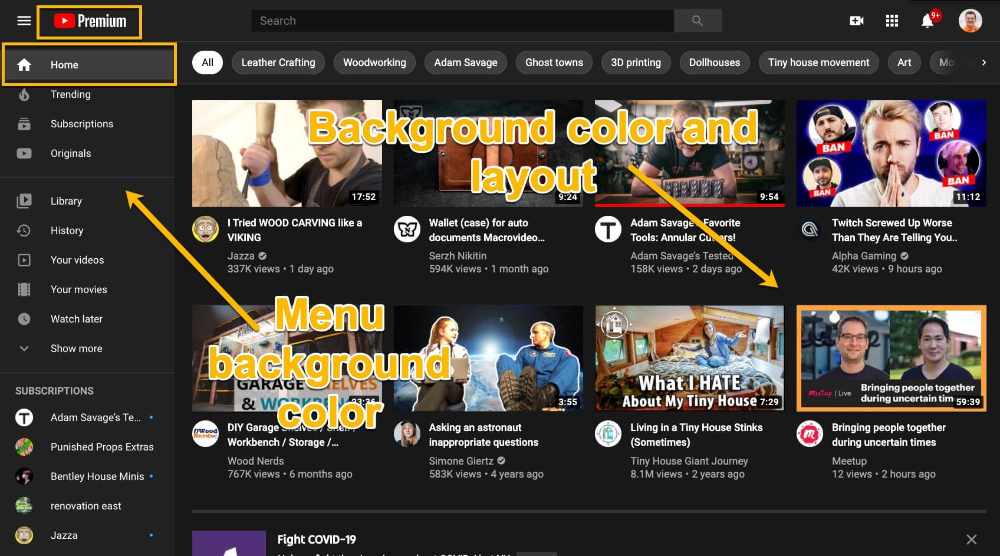
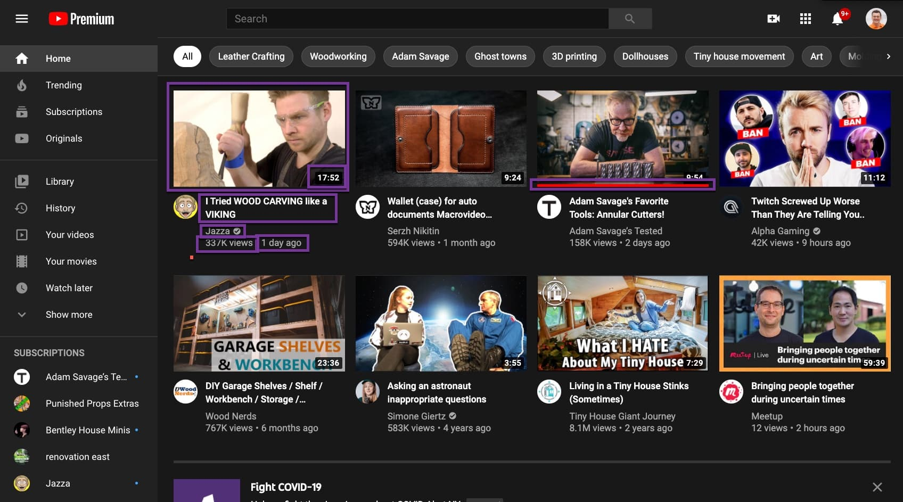
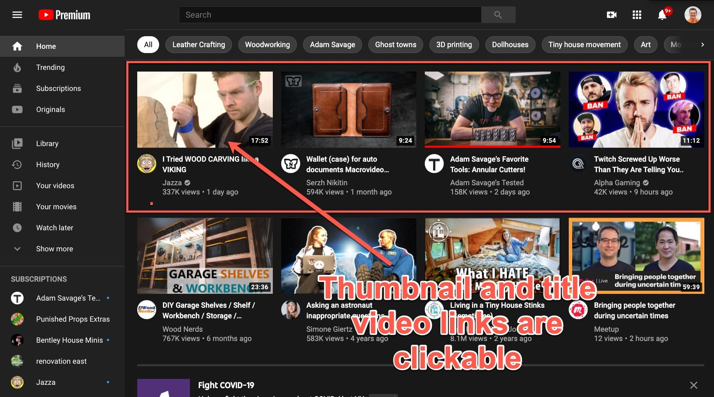
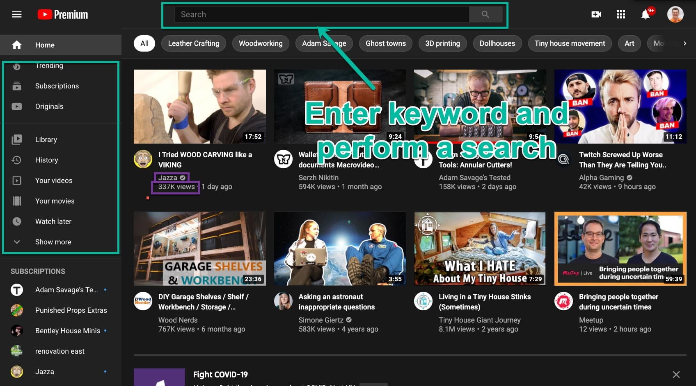
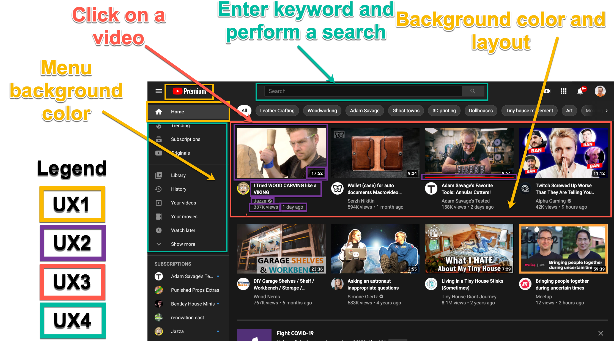
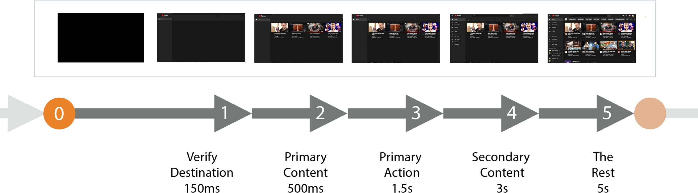

# Progressive Enhancement Phases and Corresponding Zones

Loading of each view on web sites can be broken down into several phases with different purpose and requirements in **progressively enhanced** user experience.

Different elements should be displayed and become interactive to fulfill the goals of each phase.

We can group these elements together into so-called "zones" and measure appearence of each zone as individual performance metrics. We call these "UX speed metrics".

Note: each phase has a numeric index (e.g. `UX1`), used to make it easier to refer to each phase, but also indicating ideal sequence in which elements withing the zone appear or become interactive.

-   [Progressive Enhancement Phases and Corresponding Zones](#progressive-enhancement-phases-and-corresponding-zones)
    -   [UX1: Destination Verified](#ux1-destination-verified)
    -   [UX2: Primary Content Displayed](#ux2-primary-content-displayed)
    -   [UX3: Primary Action Available](#ux3-primary-action-available)
    -   [UX4: Secondary Content / Action](#ux4-secondary-content--action)
-   [Progressive Enhancement Documentation & Design](#progressive-enhancement-documentation--design)
    -   [Designing for speed](#designing-for-speed)

## UX1: Destination Verified

We use the term "Destination Verified" to describe the moment when enough UI elements were displayed for the user to consider that **they landed on the page/view they intended to land on**.

Reducing the time user waits for this is critical for improving (reducing) bounce rates for both:

-   external links from other web sites like search engines, paid ads or social media / other marketing publications
-   internal links between pages when user browses the content

Most common elements include core branding elements like logo and brand colors (e.g. navigation bar background) as well as view title.

Other examples include:

-   current location in navigation menu
-   breadcrumbs - for views with high hierarchy where title alone is not enough to describe the view uniquely
-   search field with filled-out query - for ad-hoc query interfaces like keyword-based search
-   list of tags or other applied filters - for large lists of items like members list or location/zip and distance for geo-based search, e.g. for events/groups.
-   date - for the date-sensitive material like events or news articles / blog posts

Example:

## UX2: Primary Content Displayed

Primary content is content that is absolutely required for user to consume to convince them to perform a [primary action](Primary-Action) in this view.

Usually primary content is not interactive and only requires for UI elements to become visible and consists of text, styles, fonts and images.

Examples include:

-   Event titles and description, article copy
-   Main event or article photo
-   Event date and location
-   Video thumbnails
-   First slide of a carousel
-   Top row / first few search results

Notably, interactivity code, e.g. JavaScript is not necessary to display primary content and existing solutions need to be refactored to use progressive enhancement if they do not follow this rule.

One good example of such refactoring are so-called carousels which only need to display initial "slide" of the carousel which does not require any JavaScript for initial rendering. Subsequent "slides" of the carousel and code to perform animation and allow user interactivity (e.g. arrows, page
indicators, etc.) should be loaded progressively later as view loads.

It is usually considered a best practice to fit all primary content "above the fold" or in a visible area of the user's screen.

Note: It is important to distinguish primary content from other content, which is not necessary to perform primary action (see [Secondary Content / Action](#ux4-secondary-content-action)).

Example:

## UX3: Primary Action Available

Primary action is the most important action we intend for a user to make on a particular view.
On marketing pages it is often called a Call To Action (CTA).

It is considered ready when it is both visible on the screen and ready to be used (e.g. clickable).

Examples include:

-   "RSVP" button on event pages
-   Article excerpt's headline or "read more" link to article page on news site's homepage
-   "Add to Cart" buttons on e-commerce product description pages
-   Video playback button for video players

Note: It is important to distinguish it from other actions user can perform (see [Secondary Content / Action](#ux4-secondary-content-action)).

Example:

## UX4: Secondary Content / Action

Secondary content and action are the most important content and action that user would want to perform if they decided NOT to perform primary action after consuming primary content.

It is also important to distinguish secondary content / action from the rest of the elements within the view that are less important for the user. It is critical to identify only several secondary elements in order to set reasonable expectations.

Common examples include:

-   Sidebars, secondary content like event location map
-   Secondary navigation
-   User-generated content, sharing buttons, ads

Similarly to primary content, it is usually considered a best practice to fit all secondary content "above the fold" or in a visible area of the user's screen leaving out the rest of the content.

Example:

# Progressive Enhancement Documentation & Design

Documenting multiple zones can be done with annotating a single screenshot as a quick business interview artifact.

Annotation example:

Note: multiple screenshots are usually produced for individual page depicting different data _variations_ of the view (e.g. active vs. sold product for a product details page) and different UI breakpoints (e.g. mobile, desktop and etc) and etc. It is easy to miss some of these details in conversations and having implementation engineers in the room together with product managers and designers is usually required to catch all important the variations.

## Designing for speed

Annotation can be done for both, existing and new functionality and can benefit both optimization and ground-up construction of the progressively enhanced experiences.

Product managers, designers and engineers can work together to "design the speed" of the experience.

It is useful to visualize the result of the annotation as a progressive storyboard that can be used as a guide for construction and for later web performance "film strip" diagrams captured in synthetic testing of resulting views.

Example progressive storyboard:

Note: annotated time expectations for the storyboard which can be used as a guide to realistic perception of the final product. I can also be used to produce page load animatics to aid decision making and requirements documentation. Real user measurement data should be consulted and engineers should be involved in assesment of viability of the decisions during speed design phase.
