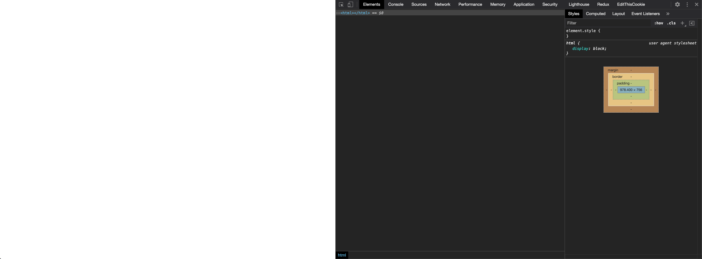
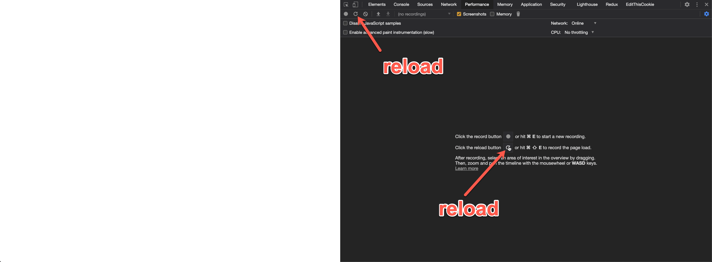
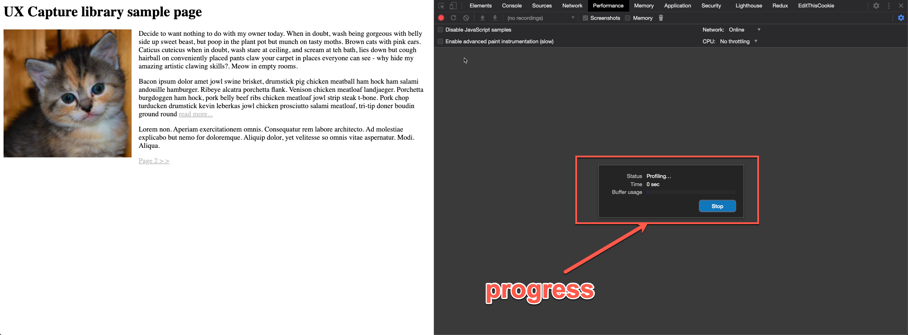
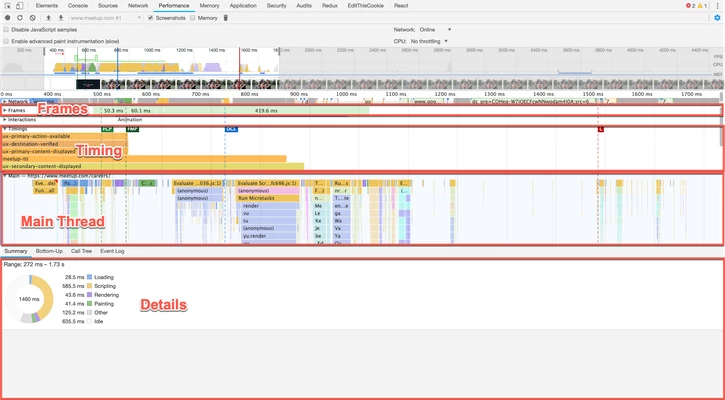
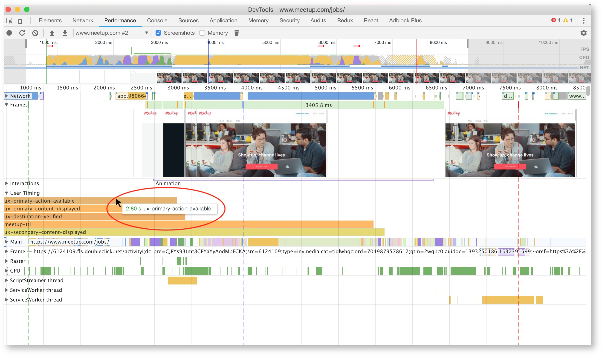
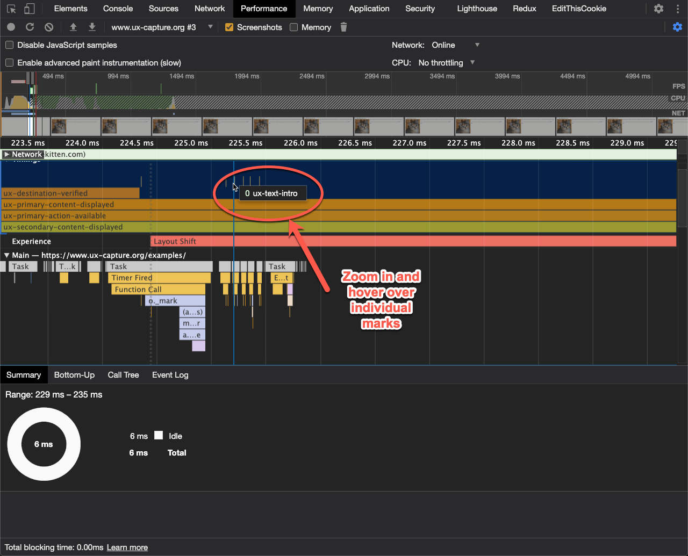
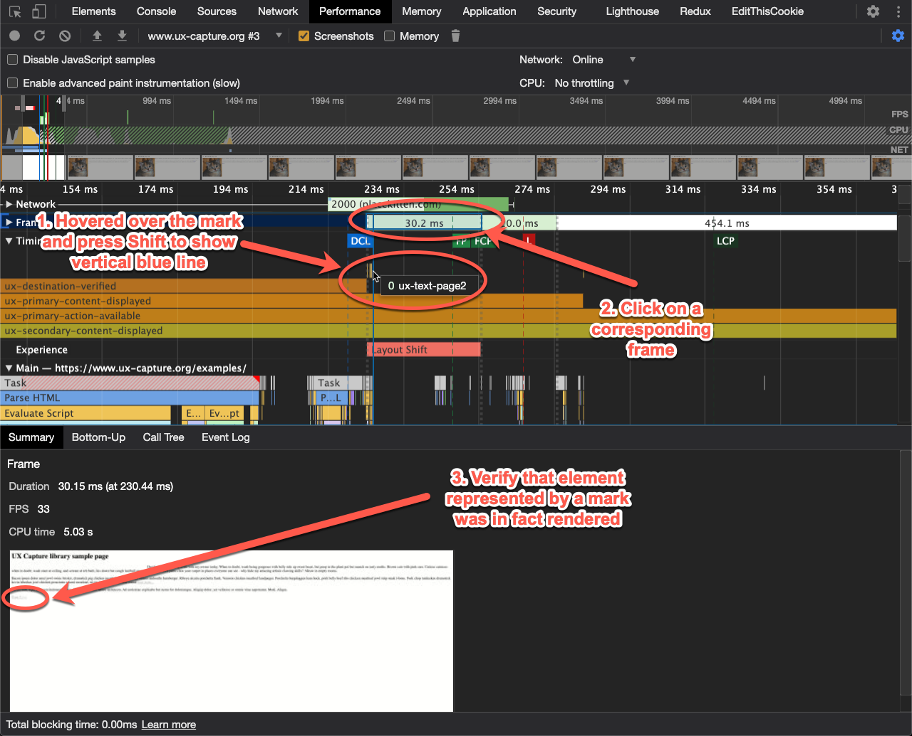

# Testing UX Capture Instrumentation

Once [UX Capture React bindings](../packages/react-ux-capture/README.md) or [core JS library instrumentation](../packages/ux-capture/README.md) have been added to a route or feature, use these steps to view and evaluate the results in Chrome Devtools.

## Step-by-step guide

These steps can be used either in dev or prod:

1. Navigate to your page that contains the UXCapture instrumentation. Open Chrome DevTools Elements tab and delete `<head>` and `<body>` tags to keep the URL, but make the page empty. This will help show empty frames at the beginning of image capture in the next step.

2. Switch to **Performance Tab**. Click the **Reload** button so that Chrome Devtools begins profiling.

3. While the profiling is happening, you'll see a progress bar in DevTools and the page will reload/refresh itself. This step may take several seconds. See screenshot.

4. Once the profile is loaded, there are **three main sections** to focus on for UXCapture: **Frames**, **Timings** and **Main** (Thread). It's easier to collapse frames section (and rely on detail view) but expand Timings and Main Thread sections one at a time because they all occupy quite a lot of space and become hard to scroll between when all are expanded. See screenshot:

5. Expand the **User Timing** section to see all of the zones defined in the page reported as [Browser Performance Measures](https://developer.mozilla.org/en-US/docs/Web/API/User_Timing_API#Performance_measures) - specifically `ux-destination-verified`, `ux-primary-content-displayed`, `ux-primary-action-available` and `ux-secondary-content-displayed`. If you didn't define one of the zones (e.g. there is no secondary content), then you will not see a corresponding measure for it in this section.

> Measures are recorded once all the corresponding marks for that zone have been recorded. If a mark is missing/not recorded, you won't see the measure either.

6. **Hover** over each of the measure labels to see the corresponding time at which that measure was recorded. See screenshot.

7. As of Chrome 87, [DevTools now show **performance marks** in the **Timings** section](https://developers.google.com/web/updates/2020/10/devtools#perf-mark) as vertical stripes, all in one line right above the measure bars, you can hover over individual marks to see their names.

> Note that `0` next to the name represents duration and can be ignored (e.g. momentary event).

You can zoom in and out of the timeline using mouse scroll button to better see individual marks, just make sure to zoom back out when you search as search is scoped to the zoomed in area only.

8. Find a frame that was displayed when mark was recorded and make sure that this is the correct moment when mark is supposed to fire, e.g. text you expected to see is actually displayed in **current frame OR the frame immediately following the current frame**.

You can press Shift to show a vertical blue line across all sections to help pinpoint the frame that corresponds to the recorded mark.

> Keep in mind that marks that correspond to attaching event handlers will not have visual representation on the timeline. It is common however for them to correspond to React rehydration cycle which can be visible due to change in other elements.

If you see significant discrepancies between marks timestamps and frames in which functionality you are trying to instrument is showing up, check if you picked the right instrumentation method (e.g. inline mark instead of interactive mark).

You can use search functionality by pressing `Ctrl+F` to find a mark by name. They will additionally be found in **Main Thread** section to make it easy to connect to the rest of the document events and determine reasons for delays, for example.

9. Don't forget that text display also depends on availability of the custom fonts used on the site. Good implementations rely on `font-display` CSS property to change the behavior of custom fonts so they progressively enhance fonts once they load and it can be hard to see when it happens in the screenshots and can be tempting to discard during testing. However it is still important to test if fonts are displayed to users properly and zones/plases are only considered complete when text is visible.

> When adding UX Capture React Bindings or instrumenting using core JS library to a page or feature in dev, Chrome DevTools is the best way to verify that you have correctly implemented the marks and measures. If you see missing marks or measures in the performance profile, chances are there's a bug in the implementation.
