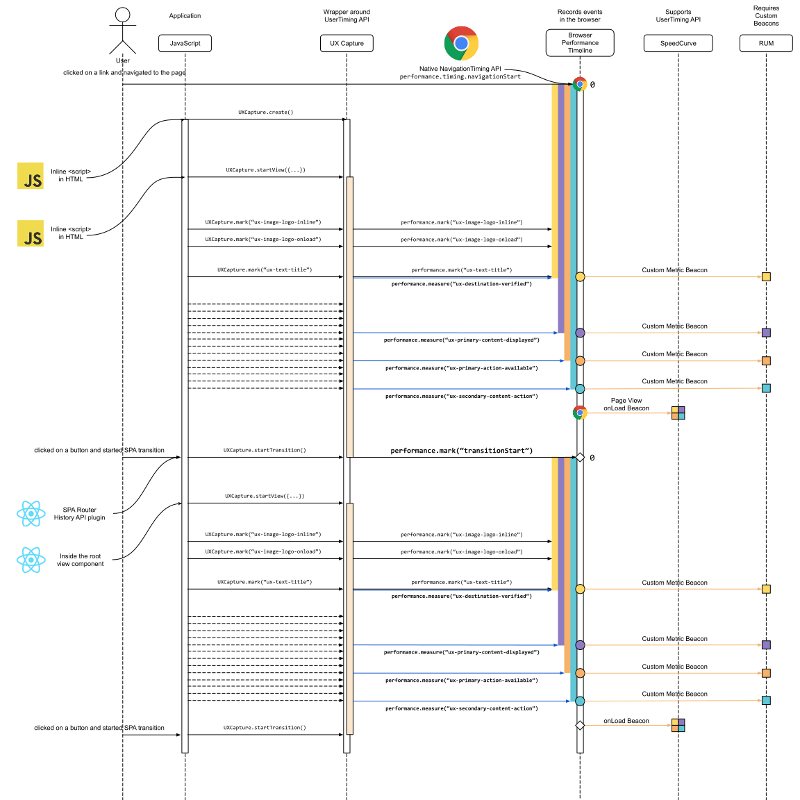

# UX Capture Core Library API Spec

This document describes API for providing zones and expected marks for multiple views.
 
For React bindings, see separate UXCapture React Bindings document.

## UX Capture Public API

```typescript
type ZoneName =
 | ‘ux-destination-verified’
 | ‘ux-primary-content-displayed’
 | ‘ux-primary-action-available’
 | ‘ux-secondary-content-displayed’

type UXConfig = {
 onMeasure?: string => void,
 onMark?: string => void,
}

type ZoneConfig = {
 name: ZoneName,
 marks: Array<string>
}

export interface UXCapture {
 static create: (UXConfig) => UXCapture,
 static clearMarks: (name?) => void,
 static startTransition: () => void,
 static startView: (Array<ZoneConfig>) => void,
 static updateView: (Array<ZoneConfig>) => void, // lazily-defined marks
 static mark: (name: string, waitForNextPaint?: boolean) => void
}
```

## Usage
Consumers should exclusively use the UXCapture static interface exported as a global variable (window.UXCapture). All other aspects of the library should be private.

For initial page view which causes full page reload or so called "browser navigation" or "(full) page view", timings are intended to correspond to loading of the initial server-rendered markup, all calls to the `UXCapture` interface must be inline in the HTML, e.g. using `<script>` elements on the page.

1. Load the library by inlining the contents of `ux-capture.min.js` in a `<script>` tag in the HTML document `<head>`.

2. Initialize `UXCapture`, optionally with mark + measure event handlers, e.g.

```javascript
<script>
 window.UXCapture.create({
 onMark: name => console.log(‘marked’, name),
 onMeasure: name => console.log(‘measured, name),
 });
</script>
```

3. At the top of the view markup, define the expected `Zone`s/`mark`s with `UXCapture.startView`, e.g.
```javascript
<script>
 window.UXCapture.startView(
   [{ name: ‘foo’, marks: [‘ux-1’, ‘ux-2’] }]
 );
</script>
```

`startView`  will throw an error if called while previous view is active, so be careful to only call it once, before any of the marks are triggered within the view markup.

4. (optional) more zones can be added to a view that has already been started using `UXCapture.updateView`.
5. Call `UXCapture.mar`k in the HTML markup for each ‘mark’ name passed into `UXCapture.startView`/`updateView`.
```javascript
<script>window.UXCapture.mark(‘ux-1’)</script>

```
6. (SPA support) For 'interactive' view changes (usually associated with a route change), the client app must imperatively indicate when the current view is no longer valid using `UXCapture.startTransition`, and clear any marks that should not be considered valid for the subsequent view using `UXCapture.clearMarks(name)`. To clear all marks, omit the name argument. For marks that are associated with elements that do not change between views, there is no need to clear the mark.

The call to `UXCapture.startTransition` does not need to be in the markup (and generally shouldn’t be).
Note: `UXCapture.mark` can be called at any time, even before the mark name is defined by a UXCapture.startView call – views are able to read marks that already exist.

```javascript
history.push(‘/foo’)
window.UXCapture.startTransition();

// or, a little less controlled:
window.onpopstate = window.UXCapture.startTransition
```

Summary: A SPA view transition is comprised of the following calls:
a. UXCapture.startTransition() – required
b. UXCapture.clearMarks(name) – optional, but should be called for each existing mark that is no longer valid

7. Repeat from (3)

## Sequence Diagram


## Implementation details

### `UXCapture.create`
Instantiates/re-uses a singleton UXCapture instance that manages the View lifecycle.
Each View instance will manage the lifecycle of its Zones

### `UXCapture.startTransition`
Destroys existing view and sets a new reference ‘start’ mark for the subsequent view as soon as it is called

### `UXCapture.startView`
Creates new `View` and stores a reference to the instance

### `UXCapture.updateView`
Merge new `zoneConfig`s with existing view’s `zoneConfig`s
- a new `Zone` will be created for any name that has not already been defined
- The `ExpectedMark`s will be merged with any existing `Zone` with the same name

## Public API Requirements
1.  Define views before transition happens to assure minimal lookup time for this information, e.g. without any network requests to load the code required for the view
2. Have a step for activating new set of expected zones, e.g. UX.startView(); which also marks beginning of the view (takes care of differences between single page view tracking and multiple view tracking, e.g. resetting marks, creating new "transitionStart" mark, etc.)
3. Allow for coupling view configuration with routing as default and most common use-case
  - Should allow for any router implementation and should not be tied to React framework
4. Also allow non-route based view configuration, e.g. for overlays or other interactive features that do not traverse to a new route, but still warrant separate views with concern for performance.
5. Should support all the use-cases for setting marks, including use-case where full set of expected marks is data-driven (see Support
adding items to zone as page loads ticket)

### Out of scope / Next Version
- Should create additional abstraction layer that defines individual UI “components” (not React components) and corresponding HTML
elements separately, e.g. “product image” and  element that require two marks each for UserTiming versus text node which
requires one mark. Or even allow other methods of measurement, e.g. ElementTiming API
  - Element selectors for visualization of a component can have different granularity than UserTiming marks HTML elements, e.g. can be a CSS selector for a bounding HTML element corresponding to a component (defined at more broad design stage) rather than individual HTML elements in it (defined during more granular technical instrumentation stage).
  - Make API as future-compatible as possible and align it with Performance Timeline API and known new API like Element Timing API

## Internal API
### `View`
Essentially just a collection of `Zones`, with the `View`’s `onMark` and `onMeasure` props passed into each `Zone`.

### `Zone`
A collection of `ExpectedMarks` that fires `onMeasure` when every corresponding mark has been set.

### `ExpectedMark`
A class that ensures each unique mark name corresponds to a single call to the `window.performance.mark` when `UXCapture.mark` is called.

Also provides interface for clearing/destroying marks.

### General design pattern
Each class constructor takes a configuration object as an argument, similar to React component classes. This object is assigned to the instance’s
`this.props` property. This ‘standard’ behavior is provided by a `UXBase` class and allows most/all classes to avoid explicitly defining a constructor
at all – instead, class properties can assign values based on `this.props`.

Example implementation:
```javascript
class UXBase {
 constructor(props) {
 this.props = props;
 }
}

class ExpectedMark extends UXBase {
 // this.name not needed - use `this.props.name`
 // no constructor
}

class View extends UXBase {
 this.expectedZones = this.props.zoneConfigs.map(...);
 // no constructor
}

class Zone extends UXBase {
 marks = this.props.marks.map(...);
 // measureName not needed - use this.props.name
 // onMeasure not needed - use this.props.onMeasure
 // onMark not needed - use this.props.onMark
 // startMarkName not needed (default to 'navigationStart')
 // no constructor
}
```

The `UXBase` class both reduces boilerplate and enforces structural consistency. Since it also matches React's constructor behavior it would also
feel familiar anyone with React experience.
